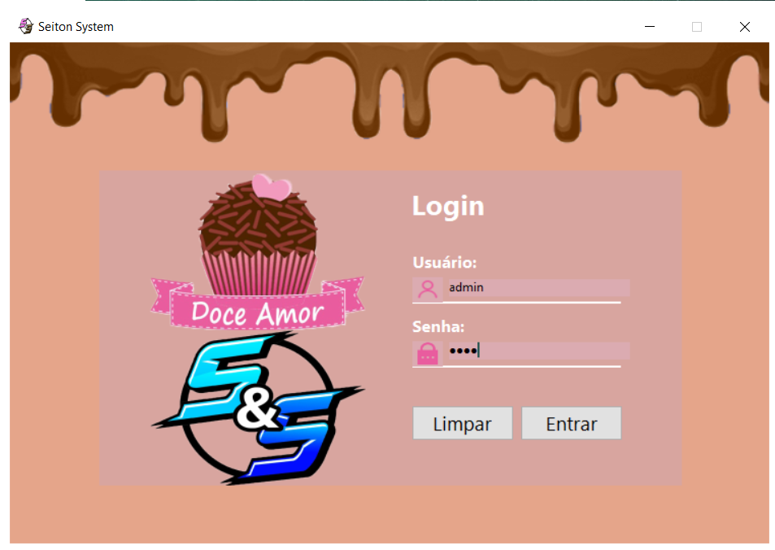
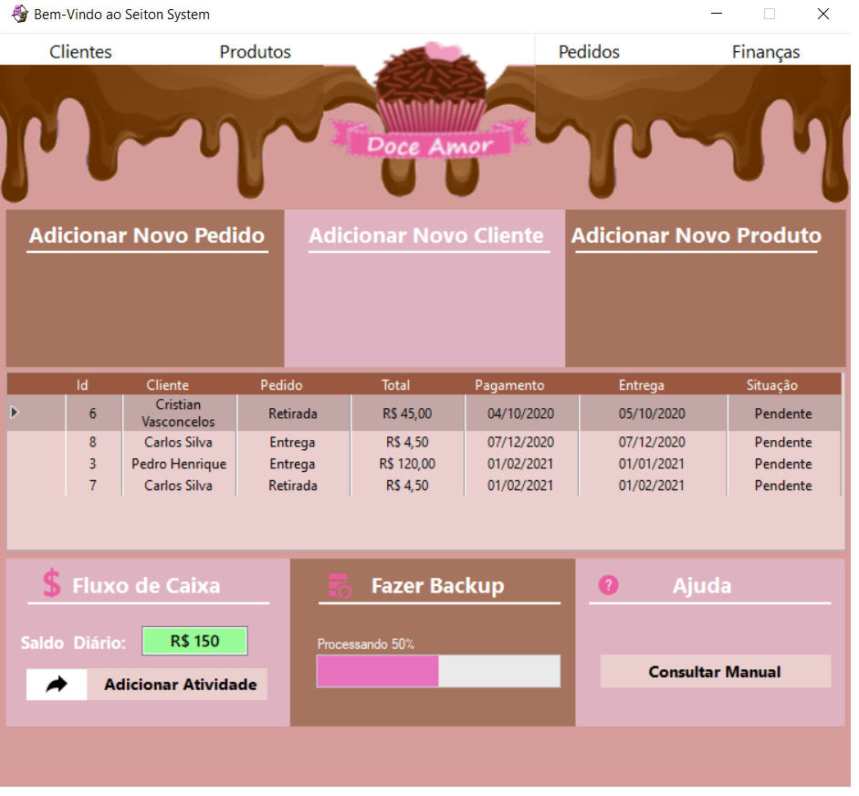
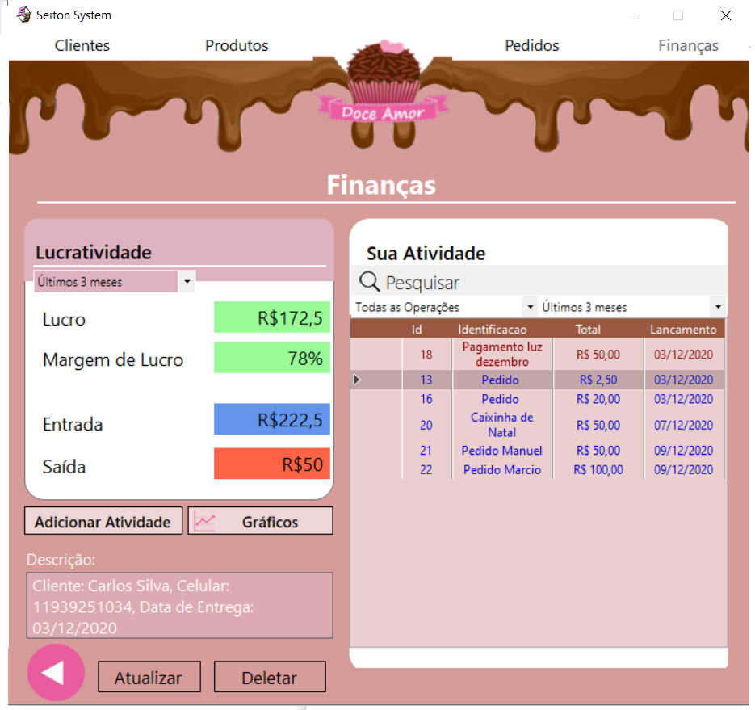

# PROGRAMA PARA CONTROLE DE VENDAS E GASTOS 💰

## Projeto desenvolvido com proposito de ser um modelo de aplicação para administração de pequenos negócios

--------------------------------------------------------------------------------------------
## PRÉ-REQUISITOS 

* Plataforma .NET

* Visual Studio

* Banco de Dados MySql

* Servidor Apache

* Conector MySql para .NET

* Provider MySql para Visual Studio

---------------------------------------------------------------------------------------------------------------------------------------------------------------------------
## ESTRUTURA DO PROJETO 

SeitonSystem\src\dto  -------------------	Responsável pela criação das Entidades principais do programa

SeitonSystem\src\dao  -----------------------	Responsável pela criação de todos os métodos para Leitura, Atualização, Exclusão e Criação de registros no banco de dados

SeitonSystem\src\controller ---------------------	Responsável por fazer a intermediação entre a camada de interface do usuário com o banco de dados criado no diretório dao

Seiton System\src\view	------------------- Responsável pela interface do programa, utilizando programação orientada a eventos e a objetos.

----------------------------------------------------------------------------------------------------------------------------------------------------------------------------

## FERRAMENTAS UTILIZADAS

.NET -----------------------------------------Plataforma de desenvolvimento do projeto

MetroUI --------------------------------------Framework para design dos formulários

HeidSql---------------------------------------Ferramenta gráfica de SGBD	Visual Studio 2017- IDE

Xamp------------------------------------------Servidor local de código aberto para o banco de dados MySql	

Linguagem de Programação C#--------------------- Para desenvolver a lógica de programação do sistema

Interface------------------------------------ Windows Forms

Sistema Operacional --------------------------Windows 10

 
 
 
 
 
   
 
 
 
